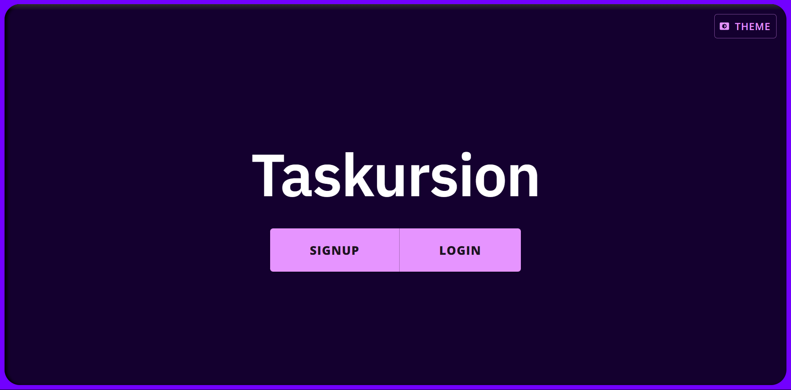

# Taskursion (WIP)

By: [SaahirM](https://github.com/SaahirM)

## Description
A task-tracking web app with the ability to organize tasks into endless layers of subtasks. This is just a personal project.

## Prerequisites
To get a demo of this project running on your local device, you will need:
- [Node.js](https://nodejs.org/)
- [A local MySQL server](https://dev.mysql.com/doc/mysql-getting-started/en/)
<!-- TODO - Change MySQL references to MongoDB -->

## Getting Started

Follow these steps to get the app running:

1. Make a copy of the file `.env.example` and name this copy `.env`.
1. Update `.env`. Change the database credentials (host, username, etc) so they point to your local MySQL server.
1. Launch a terminal at the root project directory `/taskursion`.
1. Run the command `npm install`.
1. Type `npm run build` to build the app, or `npm run build-demo` to build the app and populate the database with some dummy data.
1. Now type `npm start` to run the built app.
1. Navigate to "http://localhost:3000" using a browser.

You should see the app's homepage, which looks like this:

## Resources

### Built With

These are some of the development tools I used
- [Next.js](https://nextjs.org/), with [`create-next-app`](https://github.com/vercel/next.js/tree/canary/packages/create-next-app).
- [Material UI](https://mui.com/)